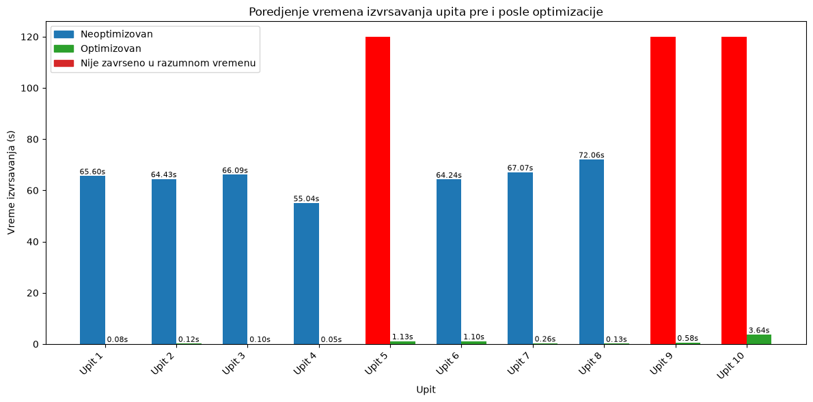

# Projekat iz predmeta SBP

***Tema:*** Analiza Open Library skupa podataka

***Autori:*** Marko Joknić IN4/2022, Srđan Jović IN56/2022

#### Opis skupa podataka

Za potrebe projekta korišćen je skup podataka projekta [Open Library](https://openlibrary.org/developers/dumps) (Internet Archive), jedne od najvećih otvorenih digitalnih biblioteka na svetu. Podaci su preuzeti u obliku mesečnih dump fajlova. Skup sadrži metapodatke o književnim delima, autorima i korisničkim ocenama, i omogućava analizu književnih dela, autora i ocena primenom MongoDB agregacionih upita.

Korišćene su tri kolekcije:
- **works** – književna dela na konceptualnom nivou (naslov, autori, teme, godina objavljivanja, revizije). Oko 41 milion dela.
- **authors** – podaci o autorima (ime, datum rođenja i smrti, mesto života ili rada). Oko 15 miliona autora.
- **ratings** – korisničke ocene dela (vrednost od 1 do 5, sa datumom dodele). 621 724 ocena.

Veličina preuzetih podataka je približno 29 GB. Dump fajlovi za `works` (oko 23 GB) i `authors` (oko 6 GB) su tab-separated, gde svaki red sadrži pet kolona (tip zapisa, ključ, revizija, datum izmene i JSON dokument), pri čemu je od interesa peta kolona. Fajlovi su čitani red po red bez učitavanja u memoriju, a neispravni JSON redovi se preskaču uz brojanje. Skup pokriva književna dela iz različitih država, jezika i istorijskih perioda.

## Rezultati

#### Šeme baze podataka

Za potrebe projekta kreirane su dve šeme baze podataka, pri čemu je glavni cilj pri kreiranju druge šeme bilo poboljšanje performansi upita.

Inicijalna šema prati strukturu skupa podataka i sastoji se od tri odvojene kolekcije (`works`, `authors`, `ratings`) povezane preko referenci (`works.authors.author.key` → `authors.key` i `ratings.work_key` → `works.key`). Za upis podataka iz dump fajlova u bazu korišćena je Python skripta (biblioteka `pymongo`), koja podatke učitava u serijama radi brzine.

Druga šema kreirana je transformacijom prve, uz upotrebu šablona proširene reference (*Extended Reference Pattern*) i šablona proračunavanja (*Computed Pattern*), čime je formirana nova kolekcija `works_prosirena` (`works_computed`):
- **Šablon proširene reference** – u okviru svakog dela lista autora proširena je tako što je pored reference (`key`) dodat i naziv autora (`name`) iz kolekcije `authors`. Time upiti mogu direktno prikazivati ime autora bez `$lookup` operacije.
- **Šablon proračunavanja** – za svako delo unapred su izračunate i sačuvane vrednosti prosečne ocene (`prosecna_ocena`) i broja ocena (`broj_ocena`) na osnovu kolekcije `ratings`, čime se eliminiše ponovno agregiranje ocena pri svakom upitu.

Pored restrukturiranja šeme, nad pojedinim poljima podignuti su indeksi. Indeksi su birani prema poljima koja se koriste za filtriranje, spajanje i sortiranje, uz primenu **ESR pravila** (Equality, Sort, Range). Za dela sa multikey poljima korišćen je i parcijalni indeks (`partialFilterExpression`).

#### Upiti

Deset pitanja postavljeno je iz perspektive različitih uloga (istraživač književnosti i istorije, analitičar književnog kataloga i slično):

1. **Dela objavljena između 1480. i 1500. godine** – prikaz dela čiji `first_publish_date` pada u zadati opseg, sortirano hronološki.
2. **Broj dela o Londonu ažuriranih u poslednjih 10 godina, po godinama** – za dela vezana za London, broj dela ažuriranih po svakoj godini (2016–2026).
3. **Najčešće revidirana dela o 20. veku** – dela čiji `subject_times` sadrži „20th century", sortirana po broju revizija opadajuće.
4. **Najčešći žanrovi dela kojima je radnja u periodu Prvog svetskog rata** – za dela o WWI izdvajaju se `subjects` i broji njihovo pojavljivanje.
5. **Najbolje ocenjena dela na osnovu ocena postavljenih posle 2020. godine** – prosečna ocena i broj ocena po delu (uslov: najmanje 5 ocena), TOP 20. Naslov se dobija spajanjem sa `works`.
6. **Istorijski periodi u delima vezanim za Srbiju** – za dela čiji `subject_places` sadrži „Serbia", broji pojavljivanje istorijskih perioda (`subject_times`). Koristi parcijalni indeks.
7. **Broj dela iz filozofije po decenijama** – dela iz oblasti filozofije grupisana po deceniji objavljivanja.
8. **Dela o Srbiji objavljena pre Drugog svetskog rata** – dela vezana za Srbiju objavljena zaključno sa 1939. godinom, hronološki.
9. **Najnovija istorijska dela sa imenima autora** – najnovija dela iz oblasti istorije zajedno sa imenima autora (prvobitno preko `$lookup`, zatim optimizovana verzija bez njega, nad kolekcijom `works_computed`).
10. **Najbolje ocenjeni autori** – prosečna ocena po autoru uz uslov od najmanje 3 ocenjena dela; TOP 20 autora sa brojem dela i ukupnim brojem ocena.

Za svako pitanje prvo se izvršava neoptimizovana verzija upita, zatim se kreira odgovarajući indeks (ili nova šema), pa optimizovana verzija. Kod upita koji nad inicijalnom šemom ne mogu da se završe (upiti 5, 9 i 10 sa `$lookup` nad punim kolekcijama) koristi se fiksni timeout (120 s) kao referentna vrednost za poređenje.

#### Performanse

Procena performansi izvršena je merenjem vremena izvršavanja pomoću `time.perf_counter()` u Jupyter okruženju, pri čemu su rezultati sačuvani u rečniku `vremena`. Za svaki upit upoređeno je vreme neoptimizovane i optimizovane verzije, a rezultati su prikazani grupisanim stubičastim dijagramom (`matplotlib`).

Optimizacija je postignuta kombinacijom:
- kreiranja jednopoljnih i kombinovanih indeksa (uz ESR pravilo),
- parcijalnih indeksa za multikey polja,
- restrukturiranja šeme (Extended Reference + Computed Pattern), čime su eliminisane najskuplje `$lookup` i agregacione operacije u vreme izvršavanja upita.

